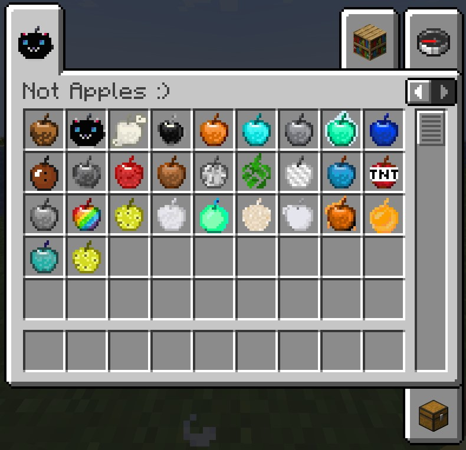

# Not Apples Mod

**Not Apples Mod** is a Minecraft mod that lets you craft a variety of unique apples,
each offering special effects to enhance your gameplay.
These apples can aid you in battles, exploration, and more.

*A showcase of the unique apples available in the mod.*

## 📜 Features

Craft new types of apples with distinct effects!
Each apple is crafted using materials found in the game and provides different abilities or buffs.

## 🛠️ Crafting Recipes

Want to know how to craft each apple? 
Check out the full guide with all recipes here:
[**How to Craft Each Apple**](./RECIPES.md)

## 🛠️ How It Works

1. Craft the apples using materials from the game.
2. Each crafted apple provides a unique effect, ranging from combat buffs to to utility enchancements.
3. Explore and experiment with different apples to discover their powers!

## 📦 Installation 

1. Download the mod `.jar` file from [Modrinth](https://modrinth.com/mod/not-apples).
2. Place it in the `mods` folder in your Minecraft directory.
3. Launch the game, and enjoy your apple adventure!

## 🔧 Compatibility

- Minecraft Version: **1.21.3**.
- Requires **Fabric**.

---

In the feature i will add more apples with more fun ideas!

Enjoy crafting and discovering the powers of your apples! 🍏🍎 :)